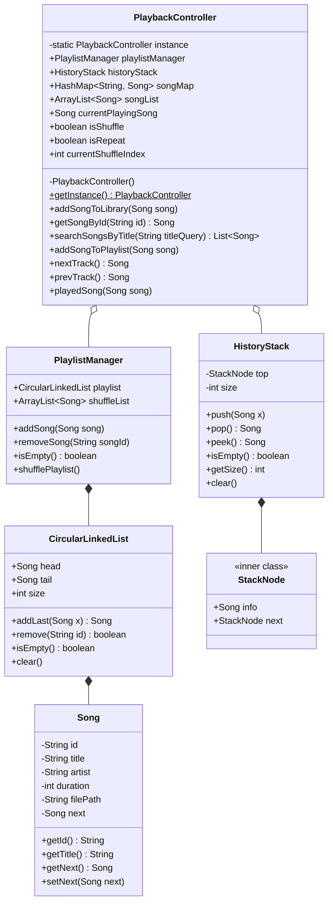

# Report 2: Abstraction, Algorithm Design & Trace

## 1. Abstraction

### 1.1. Package Structure
The system adheres to Object-Oriented Programming (OOP) and the Single Responsibility Principle (SRP), divided into 3 main packages:
*   **`model`**: Contains the `Song` class which stores entity information with full encapsulation (private attributes, accessed via getters/setters).
*   **`dsa`**: Contains custom-built data structures: `CircularLinkedList` (for the playlist) and `HistoryStack` (for playback history).
*   **`service`**: Contains business logic and coordination: `PlaylistManager` (manages adding/removing songs in the playlist and shuffling) and `PlaybackController` (the central coordinator for the playback workflow, utilizing the Singleton design pattern).

### 1.2. Class Diagram
The class diagram below is designed to match the actual running source code exactly:



### 1.3. Data Structure & Proposed Rationale (Why)
*   **Circular Linked List (CLL)**: The best choice for **Repeat Mode**. Having the tail node point back to the head node allows the `nextTrack()` operation to run cyclically forever with $O(1)$ time complexity without needing boundary conditional checks (if-else) like an Array.
*   **Stack**: Perfect for **Previous Mode**. Transitioning between songs is inherently a historical action. Applying the LIFO (Last-In-First-Out) rule helps accurately restore the most recently played song with $O(1)$ cost, regardless of whether the playlist is shuffled or not.
*   **Dynamic Array (ArrayList)**: Optimal for **Shuffle Mode** and **Library Storage**. Linked lists do not support random access (only sequential traversal $O(N)$). Dynamic arrays allow extremely fast random access with $O(1)$ via index, which is highly suitable for applying the random shuffle algorithm.
*   **HashMap**: Used to store the Library in a Key-Value (ID-Song) format, making the querying (Lookup) of song information by ID achieve $O(1)$ speed instead of having to scan the entire list.

---

## 2. Playback Workflow (Flowchart)
The flowchart below describes the main workflow of the `PlaybackController` when the user performs Play, Next, and Previous actions.

```mermaid
flowchart TD
    %% Define nodes
    StartUser((User Interaction))
    
    ActionPlay[Play a song\nPlay(Song)]
    ActionNext[Play next track\nnextTrack()]
    ActionPrev[Play previous track\nprevTrack()]
    
    StartUser --> ActionPlay
    StartUser --> ActionNext
    StartUser --> ActionPrev

    %% === PLAY FLOW ===
    subgraph Play_Flow [Play Track Flow]
        PlayCheck{Is a song\nplaying?}
        PlayPushStack[Push current song\ninto HistoryStack]
        PlayUpdate[Update currentPlayingSong\nwith new song]
        
        ActionPlay --> PlayCheck
        PlayCheck -- Yes --> PlayPushStack --> PlayUpdate
        PlayCheck -- No --> PlayUpdate
    end

    %% === NEXT FLOW ===
    subgraph Next_Flow [Next Track Flow]
        NextCheckEmpty{Is Playlist empty?}
        NextShuffleCheck{isShuffle = True?}
        
        NextCLL[Retrieve via CircularLinkedList:\nnextSong = current.getNext()]
        
        NextArr[Retrieve from shuffled array:\nnextSong = shuffleList.get(index)]
        NextArrIndexUpdate[Increment currentShuffleIndex++]
        NextArrEndCheck{Index >= \nShuffleList.size?}
        NextArrShuffle[Reshuffle array (Fisher-Yates)\nReset Index = 0]
        
        ActionNext --> NextCheckEmpty
        NextCheckEmpty -- Yes --> ReturnNull1((Return Null))
        NextCheckEmpty -- No --> NextShuffleCheck
        
        NextShuffleCheck -- False --> NextCLL
        NextShuffleCheck -- True --> NextArr --> NextArrIndexUpdate --> NextArrEndCheck
        NextArrEndCheck -- Yes --> NextArrShuffle --> TriggerPlayedSong
        NextArrEndCheck -- No --> TriggerPlayedSong
        
        NextCLL --> TriggerPlayedSong
        TriggerPlayedSong(Call Play Track function) --> PlayCheck
    end

    %% === PREVIOUS FLOW ===
    subgraph Prev_Flow [Previous Track Flow]
        PrevCheckStack{Is HistoryStack empty?}
        PrevPopStack[Pop top song:\nprevSong = historyStack.pop()]
        PrevUpdate[Update currentPlayingSong]
        
        ActionPrev --> PrevCheckStack
        PrevCheckStack -- Yes --> ReturnNull2((Return Null))
        PrevCheckStack -- No --> PrevPopStack --> PrevUpdate
    end
```

---

## 3. DSA Design (Algorithm Design)

### 3.1. Shuffle Playlist (Fisher-Yates Algorithm)
*   **Description**: When the user enables the Shuffle feature or the playlist finishes its cycle in Shuffle mode, the system shuffles the entire `shuffleList` array using the Fisher-Yates algorithm to ensure randomness.
*   **Complexity**:
    *   Time: $O(N)$ (traverses the array once, swap operations take $O(1)$).
    *   Space: $O(1)$ (in-place shuffle, no new array allocation).

### 3.2. Play Next Track (Integrated with Shuffle)
*   **Description**: A smart branching logic between `ArrayList` and `CircularLinkedList` depending on the `isShuffle` variable.
*   **Complexity**: 
    *   Time: $O(1)$ (for both array and linked list traversals). (For the shuffled array case, Fisher-Yates only costs $O(N)$ running once when the playlist ends, so the average Amortized cost is still $O(1)$).
    *   Space: $O(1)$.
*   **Edge Cases**: Empty playlist (returns null), list with only 1 song (points to itself).

### 3.3. Previous Track (History)
*   **Description**: Pops an element from the Stack to undo. Does not recursively call the `playedSong()` function at this step to avoid an infinite loop of history saving.
*   **Complexity**: Time $O(1)$, Space $O(1)$.
*   **Edge Cases**: Empty stack (no previous song played) -> Keeps the current song.

### 3.4. Search Library By Title (Linear Search)
*   **Description**: Sequentially traverses the `songList` Array and uses a String Matching algorithm (`.contains()` function after `.toLowerCase()`) to return a list of songs matching the title.
*   **Complexity**: Time $O(N \cdot M)$ (N is the number of songs, M is the average length of a song title).

---

## 4. Algorithm Trace

**Test Case**: 
1. Initialize a playlist with 3 songs: S1, S2, S3. State: `isShuffle = false`.
2. Start playing (Play S1).
3. Press Next 2 times.
4. Turn on Shuffle (`isShuffle = true`), press Next 1 time (Assuming the shuffled Array places S1 at index 0).
5. Press Previous 1 time.

**Trace Table**:

| Step | Action | `currentPlaying` | `isShuffle` | `HistoryStack` State (Top -> Bottom) | Notes |
| :--- | :--- | :--- | :--- | :--- | :--- |
| 0 | Init Playlist | `null` | False | `[]` | Playlist: S1 -> S2 -> S3 -> S1... |
| 1 | Play(S1) | S1 | False | `[]` | Starts playing S1. Stack does not save the currently playing song. |
| 2 | nextTrack() | S2 | False | `[S1]` | Transitions to S2 (via CLL). Pushes S1 into the Stack. |
| 3 | nextTrack() | S3 | False | `[S2, S1]` | Transitions to S3 (via CLL). Pushes S2 into the Stack. |
| 4 | Enable Shuffle | S3 | **True** | `[S2, S1]` | Data flow switches to the Array. |
| 5 | nextTrack() | **S1** | True | `[S3, S2, S1]` | Retrieves S1 from the shuffled array. Pushes S3 into the Stack. |
| 6 | prevTrack() | **S3** | True | `[S2, S1]` | Pops S3 from the Stack. Independent of the original list structure. |

---

## 5. AI Audit & Adaptation Log

| Context / Issue | Initial Proposal (AI/Theory) | Actual Solution Applied (Human) | Reason for Modification (Why) |
| :--- | :--- | :--- | :--- |
| **Music Library Search** | AI/Theory proposed using a **Binary Search Tree (BST)** for $O(\log N)$ search. | Used **HashMap** for $O(1)$ ID retrieval and **ArrayList** combined with $O(N)$ linear traversal for title search. | Suitable for the early stages of Webapp development (Simplicity). Easier integration with an SQL Database in the future. Plans to replace it with a stronger search structure will be implemented in the next phase. |
| **Singleton Pattern** | AI did not mention this in the initial Class Diagram. | Used the **Singleton** pattern for `PlaybackController` with `getInstance()`. | In a Webapp, requests from multiple clients can create multiple threads. Singleton helps maintain a single, unified music controller for the entire session. |
| **Previous Track Logic** | AI previously suggested using a reverse pointer on a Doubly Linked List. | Rejected, finalized using a **LIFO Stack** operating completely independently of the playlist. | A Doubly Linked List logic would break down when Shuffle is turned on. Using a Stack ensures absolute preservation of the true history. |
