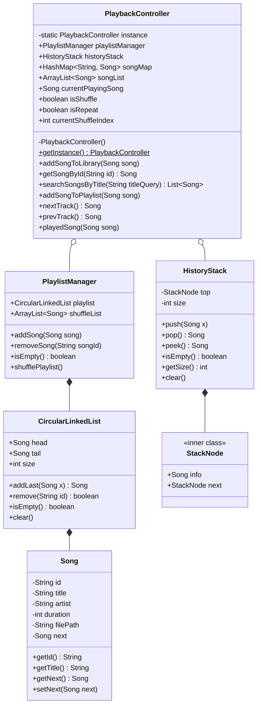

# Report 2: Abstraction, Algorithm Design & Trace

## 1. Abstraction (Trừu tượng hóa)

### 1.1. Package Structure (Cấu trúc gói)
Hệ thống tuân thủ thiết kế hướng đối tượng (OOP) và nguyên lý đơn trách nhiệm (SRP), chia thành 3 package chính:
*   **`model`**: Chứa lớp `Song` lưu trữ thông tin thực thể với tính đóng gói (encapsulation) hoàn toàn (thuộc tính private, truy cập qua getter/setter).
*   **`dsa`**: Chứa các cấu trúc dữ liệu tự xây dựng: `CircularLinkedList` (cho danh sách phát) và `HistoryStack` (cho lịch sử phát nhạc).
*   **`service`**: Chứa logic nghiệp vụ điều phối: `PlaylistManager` (quản lý thêm/xóa bài trong playlist và xáo trộn) và `PlaybackController` (Trung tâm điều phối luồng phát nhạc, áp dụng mẫu thiết kế Singleton).

### 1.2. Class Diagram (Sơ đồ lớp)
Sơ đồ lớp dưới đây được thiết kế sát hoàn toàn với mã nguồn thực tế đang chạy:



### 1.3. Data Structure & Lý do đề xuất (Why)
*   **Circular Linked List (CLL)**: Lựa chọn tốt nhất cho **Repeat Mode**. Việc Node cuối (tail) trỏ ngược lại Node đầu (head) giúp thao tác `nextTrack()` chạy tuần hoàn vĩnh viễn với thời gian $O(1)$ mà không cần rẽ nhánh kiểm tra (if-else) biên như dùng Mảng.
*   **Stack (Ngăn xếp)**: Hoàn hảo cho **Previous Mode**. Bản chất chuyển bài hát là một hành động có tính lịch sử. Áp dụng quy tắc LIFO (Last-In-First-Out) giúp khôi phục chính xác bài hát vừa nghe với chi phí $O(1)$, bất chấp việc danh sách phát có bị xáo trộn hay không.
*   **Dynamic Array (ArrayList)**: Tối ưu cho **Shuffle Mode** và **Lưu trữ Library**. Danh sách liên kết không hỗ trợ truy cập ngẫu nhiên (chỉ duyệt tuần tự $O(N)$). Mảng động cho phép truy xuất ngẫu nhiên cực nhanh với $O(1)$ thông qua chỉ số, rất hợp để áp dụng thuật toán trộn ngẫu nhiên.
*   **HashMap**: Sử dụng để lưu trữ Library dạng Key-Value (ID-Song) giúp việc truy vấn (Lookup) thông tin bài hát bằng mã ID đạt tốc độ $O(1)$ thay vì phải quét toàn bộ danh sách.

---

## 2. Luồng Hoạt Động (Flowchart)
Sơ đồ dưới đây mô tả luồng hoạt động chính của bộ điều khiển `PlaybackController` khi người dùng thao tác Phát (Play), Tới (Next) và Lùi (Previous).

```mermaid
flowchart TD
    %% Định nghĩa các node
    StartUser((Người Dùng Tương Tác))
    
    ActionPlay[Phát 1 bài hát\nPlay(Song)]
    ActionNext[Chuyển bài tiếp theo\nnextTrack()]
    ActionPrev[Quay lại bài trước\nprevTrack()]
    
    StartUser --> ActionPlay
    StartUser --> ActionNext
    StartUser --> ActionPrev

    %% === LUỒNG PLAY ===
    subgraph Play_Flow [Luồng Play Nhạc]
        PlayCheck{Đang có bài\nhát phát?}
        PlayPushStack[Đẩy bài hiện tại\nvào HistoryStack]
        PlayUpdate[Cập nhật currentPlayingSong\nbằng bài hát mới]
        
        ActionPlay --> PlayCheck
        PlayCheck -- Có --> PlayPushStack --> PlayUpdate
        PlayCheck -- Không --> PlayUpdate
    end

    %% === LUỒNG NEXT ===
    subgraph Next_Flow [Luồng Next Track]
        NextCheckEmpty{Playlist rỗng?}
        NextShuffleCheck{isShuffle = True?}
        
        NextCLL[Lấy qua CircularLinkedList:\nnextSong = current.getNext()]
        
        NextArr[Lấy từ mảng xáo trộn:\nnextSong = shuffleList.get(index)]
        NextArrIndexUpdate[Tăng currentShuffleIndex++]
        NextArrEndCheck{Index >= \nShuffleList.size?}
        NextArrShuffle[Trộn lại mảng (Fisher-Yates)\nReset Index = 0]
        
        ActionNext --> NextCheckEmpty
        NextCheckEmpty -- Có --> ReturnNull1((Return Null))
        NextCheckEmpty -- Không --> NextShuffleCheck
        
        NextShuffleCheck -- False --> NextCLL
        NextShuffleCheck -- True --> NextArr --> NextArrIndexUpdate --> NextArrEndCheck
        NextArrEndCheck -- Có --> NextArrShuffle --> TriggerPlayedSong
        NextArrEndCheck -- Không --> TriggerPlayedSong
        
        NextCLL --> TriggerPlayedSong
        TriggerPlayedSong(Gọi hàm Phát nhạc) --> PlayCheck
    end

    %% === LUỒNG PREVIOUS ===
    subgraph Prev_Flow [Luồng Previous Track]
        PrevCheckStack{HistoryStack rỗng?}
        PrevPopStack[Lấy bài trên cùng ra:\nprevSong = historyStack.pop()]
        PrevUpdate[Cập nhật currentPlayingSong]
        
        ActionPrev --> PrevCheckStack
        PrevCheckStack -- Có --> ReturnNull2((Return Null))
        PrevCheckStack -- Không --> PrevPopStack --> PrevUpdate
    end
```

---

## 3. DSA Design (Thiết kế thuật toán)

### 3.1. Shuffle Playlist (Fisher-Yates Algorithm)
*   **Mô tả**: Khi người dùng bật tính năng Shuffle hoặc Playlist đã phát hết vòng lặp trong chế độ Shuffle, hệ thống sẽ xáo trộn toàn bộ mảng `shuffleList` bằng thuật toán Fisher-Yates để đảm bảo tính ngẫu nhiên.
*   **Complexity**:
    *   Time: $O(N)$ (duyệt mảng 1 lần, các thao tác hoán vị mất $O(1)$).
    *   Space: $O(1)$ (xáo trộn in-place, không cấp phát thêm mảng mới).

### 3.2. Play Next Track (Tích hợp Shuffle)
*   **Mô tả**: Luồng rẻ nhánh thông minh giữa `ArrayList` và `CircularLinkedList` tùy thuộc vào biến `isShuffle`.
*   **Complexity**: 
    *   Time: $O(1)$ (cho cả 2 luồng duyệt mảng và liên kết). (Trường hợp gọi mảng trộn, Fisher-Yates chỉ tốn $O(N)$ chạy một lần duy nhất khi hết playlist, trung bình cộng Amortized cost vẫn là $O(1)$).
    *   Space: $O(1)$.
*   **Edge Cases**: Playlist rỗng (trả về null), danh sách chỉ có 1 bài hát (tự trỏ về chính nó).

### 3.3. Previous Track (Lịch sử)
*   **Mô tả**: Rút phần tử khỏi Stack để hoàn tác (undo). Không gọi lại hàm `playedSong()` ở bước này để tránh vòng lặp lưu trữ vô tận.
*   **Complexity**: Time $O(1)$, Space $O(1)$.
*   **Edge Cases**: Stack rỗng (chưa từng nghe bài nào trước đó) -> Giữ nguyên bài hiện tại.

### 3.4. Search Library By Title (Tìm kiếm tuyến tính)
*   **Mô tả**: Duyệt tuần tự Mảng `songList` và dùng thuật toán String Matching (hàm `.contains()` sau khi `.toLowerCase()`) để trả về danh sách các bài hát khớp tên.
*   **Complexity**: Time $O(N \cdot M)$ (N là số bài hát, M là độ dài trung bình của tựa đề bài hát).

---

## 4. Algorithm Trace (Mô phỏng & Bảng Trace)

**Test Case**: 
1. Khởi tạo danh sách gồm 3 bài: S1, S2, S3. Trạng thái: `isShuffle = false`.
2. Bắt đầu phát (Play S1).
3. Nhấn Next 2 lần.
4. Bật Shuffle (`isShuffle = true`), nhấn Next 1 lần (Giả sử Mảng ngẫu nhiên trộn ra S1 nằm ở index 0).
5. Nhấn Previous 1 lần.

**Bảng Trace**:

| Bước | Hành động (Action) | `currentPlaying` | Biến `isShuffle` | Trạng thái `HistoryStack` (Top -> Bottom) | Ghi chú |
| :--- | :--- | :--- | :--- | :--- | :--- |
| 0 | Init Playlist | `null` | False | `[]` | Playlist: S1 -> S2 -> S3 -> S1... |
| 1 | Play(S1) | S1 | False | `[]` | Bắt đầu phát bài S1. Stack không lưu bài vừa play. |
| 2 | nextTrack() | S2 | False | `[S1]` | Chuyển bài S2 (theo CLL). Đẩy S1 vào Stack. |
| 3 | nextTrack() | S3 | False | `[S2, S1]` | Chuyển bài S3 (theo CLL). Đẩy S2 vào Stack. |
| 4 | Bật Shuffle | S3 | **True** | `[S2, S1]` | Thay đổi luồng dữ liệu sang Array. |
| 5 | nextTrack() | **S1** | True | `[S3, S2, S1]` | Lấy S1 từ mảng đã trộn. Đẩy S3 vào Stack. |
| 6 | prevTrack() | **S3** | True | `[S2, S1]` | Pop từ Stack ra S3. Không phụ thuộc danh sách gốc. |

---

## 5. AI Audit & Adaptation Log

| Bối cảnh (Context) / Issue | Đề xuất ban đầu (AI/Theory) | Giải pháp thực tế áp dụng (Human Solution) | Lý do điều chỉnh (Why Modified) |
| :--- | :--- | :--- | :--- |
| **Tìm kiếm thư viện nhạc** | AI/Theory đề xuất dùng **Binary Search Tree (BST)** để tìm kiếm $O(\log N)$. | Sử dụng **HashMap** lấy ID $O(1)$ và **ArrayList** kết hợp duyệt tuyến tính $O(N)$ để lấy danh sách bài hát theo tên. | Phù hợp với nhu cầu phát triển Web ở giai đoạn đầu (Simplicity). Dễ dàng tích hợp với Database SQL trong tương lai. Kế hoạch thay thế cấu trúc tìm kiếm mạnh hơn sẽ được triển khai ở Phase sau. |
| **Singleton Pattern** | AI không đề cập trong Class Diagram ban đầu. | Sử dụng mẫu **Singleton** cho `PlaybackController` với `getInstance()`. | Trong Webapp, request từ nhiều client có thể tạo ra nhiều luồng. Singleton giúp giữ nguyên 1 bộ điều khiển âm nhạc duy nhất cho toàn phiên (Session). |
| **Logic Previous Track** | AI từng đề xuất Dùng con trỏ dịch lùi trên Doubly Linked List. | Bác bỏ, chốt sử dụng **LIFO Stack** hoạt động hoàn toàn độc lập với danh sách phát. | Doubly Linked List sẽ sụp đổ (logic bị sai) khi Shuffle được bật. Sử dụng Stack đảm bảo lưu đúng lịch sử tuyệt đối. |
