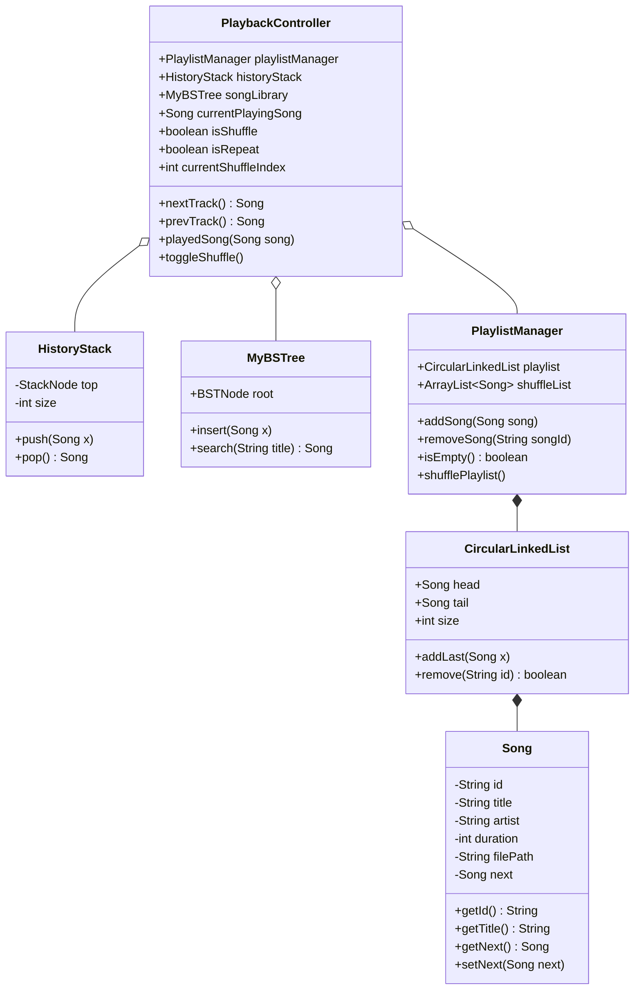

# Report 2: Abstraction, Algorithm Design & Trace

## 1. Abstraction (Trừu tượng hóa)

### 1.1. Package Structure (Cấu trúc gói)
Hệ thống tuân thủ thiết kế hướng đối tượng (OOP) và nguyên lý đơn trách nhiệm (SRP), chia thành 3 package chính:
*   **`model`**: Chứa lớp `Song` lưu trữ thông tin thực thể với tính đóng gói (encapsulation) hoàn toàn (thuộc tính private, truy cập qua getter/setter).
*   **`dsa`**: Chứa các cấu trúc dữ liệu tự xây dựng: `CircularLinkedList` (cho danh sách phát), `HistoryStack` (cho lịch sử), `MyBSTree` (cho thư viện tìm kiếm).
*   **`service`**: Chứa logic nghiệp vụ: `PlaylistManager` (quản lý thêm/xóa) và `PlaybackController` (điều phối luồng phát nhạc).

### 1.2. Class Diagram (Sơ đồ lớp)


### 1.3. Data Structure & Lý do đề xuất (Why)
*   **Circular Linked List (CLL)**: Lựa chọn tốt nhất cho **Repeat Mode**. Việc Node cuối (tail) trỏ ngược lại Node đầu (head) giúp thao tác `nextTrack()` chạy tuần hoàn vĩnh viễn với thời gian $O(1)$ mà không cần rẽ nhánh kiểm tra (if-else) biên như dùng Mảng.
*   **Stack (Ngăn xếp)**: Hoàn hảo cho **Previous Mode**. Bản chất chuyển bài hát là một hành động có tính lịch sử. Áp dụng quy tắc LIFO (Last-In-First-Out) giúp khôi phục chính xác bài hát vừa nghe với chi phí $O(1)$.
*   **Dynamic Array (ArrayList)**: Tối ưu cho **Shuffle Mode**. Danh sách liên kết không hỗ trợ truy cập ngẫu nhiên (chỉ duyệt tuần tự $O(N)$). Mảng động cho phép truy xuất ngẫu nhiên (Random Access) cực nhanh với $O(1)$ thông qua chỉ số (index).
*   **Binary Search Tree (BST)**: Lựa chọn cho **Search Song**. Cây nhị phân tìm kiếm giúp tìm bài hát theo tên (Title) nhanh hơn danh sách liên kết, tốc độ trung bình $O(\log N)$ thay vì $O(N)$.

---

## 2. DSA Design (Thiết kế thuật toán)

### 2.1. Shuffle Playlist (Fisher-Yates Algorithm)
*   **Mô tả**: Khi người dùng bật tính năng Shuffle, hệ thống sẽ xáo trộn toàn bộ mảng `shuffleList` một lần duy nhất bằng thuật toán Fisher-Yates để đảm bảo tính ngẫu nhiên và không lặp lại bài hát.
*   **Pseudocode**:
    ```text
    function shufflePlaylist():
        n = shuffleList.size
        for i from (n - 1) down to 1:
            j = random(0, i)
            swap(shuffleList[i], shuffleList[j])
    ```
*   **Complexity**:
    *   Time: $O(N)$ (duyệt mảng 1 lần, các thao tác hoán vị mất $O(1)$).
    *   Space: $O(1)$ (xáo trộn in-place, không cấp phát thêm mảng mới).

### 2.2. Play Next Track (Tích hợp Shuffle)
*   **Pseudocode**:
    ```text
    function nextTrack():
        if playlistManager.isEmpty() return null
        
        Song nextSong = null
        if isShuffle == true:
            // Truy xuất mảng đã được trộn sẵn (O(1))
            nextSong = shuffleList.get(currentShuffleIndex)
            currentShuffleIndex = currentShuffleIndex + 1
            
            // Nếu phát hết, trộn lại từ đầu
            if currentShuffleIndex >= shuffleList.size:
                shufflePlaylist()
                currentShuffleIndex = 0
        else:
            if currentPlayingSong == null:
                nextSong = playlist.head
            else:
                nextSong = currentPlayingSong.getNext()
        
        playedSong(nextSong)
        return nextSong
    ```
*   **Complexity**: 
    *   Time: $O(1)$ (cho cả 2 luồng duyệt Mảng động đã xáo trộn và duyệt Next tuần tự CLL).
    *   Space: $O(1)$.
*   **Edge Cases**: Playlist rỗng (trả về null), danh sách chỉ có 1 bài hát (next tự trỏ về chính nó).

### 2.2. Previous Track
*   **Pseudocode**:
    ```text
    function prevTrack():
        if historyStack.isEmpty() return null
        
        Song prevSong = historyStack.pop()
        currentPlayingSong = prevSong
        return prevSong
    ```
*   **Complexity**: Time $O(1)$, Space $O(1)$.
*   **Edge Cases**: Stack rỗng (chưa từng nhấn next trước đó) -> Giữ nguyên bài hiện tại hoặc thông báo lỗi.

### 2.3. Add Song
*   **Pseudocode**:
    ```text
    function addSong(Song s):
        playlist.addLast(s)     // O(1) in CLL (if maintaining tail)
        shuffleList.add(s)      // O(1) amortized in ArrayList
        songLibrary.insert(s)   // O(log N) in BST
    ```
*   **Complexity**: Time $O(\log N)$ (do thao tác chèn vào BST tốn nhiều thời gian nhất).

---

## 3. Algorithm Trace (Mô phỏng & Bảng Trace)

**Test Case**: 
1. Khởi tạo danh sách gồm 3 bài: S1, S2, S3. Trạng thái: `isShuffle = false`.
2. Bắt đầu phát (Play S1).
3. Nhấn Next 2 lần.
4. Bật Shuffle (`isShuffle = true`), nhấn Next 1 lần (Giả sử Random ra index 0 - S1).
5. Nhấn Previous 1 lần.

**Bảng Trace**:

| Bước (Step) | Hành động (Action) | `currentPlaying` | Biến `isShuffle` | Trạng thái `HistoryStack` (Top -> Bottom) | Ghi chú |
| :--- | :--- | :--- | :--- | :--- | :--- |
| 0 | Init Playlist | `null` | False | `[]` | Playlist: S1 -> S2 -> S3 -> S1... |
| 1 | Play(S1) | S1 | False | `[]` | Bắt đầu phát bài S1. |
| 2 | nextTrack() | S2 | False | `[S1]` | Chuyển bài S2 (theo CLL). Đẩy S1 vào Stack. |
| 3 | nextTrack() | S3 | False | `[S2, S1]` | Chuyển bài S3 (theo CLL). Đẩy S2 vào Stack. |
| 4 | Bật Shuffle | S3 | **True** | `[S2, S1]` | Thay đổi luồng dữ liệu sang Array. |
| 5 | nextTrack() | **S1** | True | `[S3, S2, S1]` | Random ra index 0 (S1). Lấy S1 từ Array. Đẩy S3 vào Stack. |
| 6 | prevTrack() | **S3** | True | `[S2, S1]` | Pop từ Stack ra S3. Không phụ thuộc cấu trúc danh sách gốc. |

---

## 4. AI Comparison Table (AI Audit Log)

| Bối cảnh (Context) / Issue | Đề xuất ban đầu của AI (AI Solution) | Giải pháp thực tế áp dụng (Human Solution) | Lý do điều chỉnh (Why Modified) |
| :--- | :--- | :--- | :--- |
| **Tính Đóng gói của thực thể `Song`** | Code do AI (hoặc tool) sinh ra ban đầu để tất cả thuộc tính là `public` (`public String title; public Song next;`). | Chuyển toàn bộ về `private` và tự tạo hàm `getTitle()`, `getNext()`, `setNext()`. | Để tuân thủ nghiêm ngặt nguyên lý Encapsulation của OOP như đã cam kết trong Report 1. Bảo vệ tính toàn vẹn dữ liệu. |
| **Logic Next Track khi bật Shuffle** | AI vẽ flowchart và miêu tả bằng chữ: "Lấy ngẫu nhiên từ Dynamic Array" nhưng trong Source Code thực tế lại **quên code luồng này** (luôn dùng `.getNext()`). | Cập nhật hàm `PlaybackController.nextTrack()` thêm luồng rẽ nhánh `if (isShuffle)` và dùng thư viện `Random` để gọi `.get(index)` từ `shuffleList`. | Sửa lỗi **AI Hallucination**. Thuật toán phải khớp với tài liệu thiết kế. Mảng động (ArrayList) sinh ra là để xử lý Shuffle với $O(1)$ Random Access. |
| **Xử lý "Undo" cho Previous Track** | AI từng đề xuất 2 phương án: Dùng mảng tạm (Array) hoặc Dùng con trỏ dịch lùi trên Doubly Linked List. | Bác bỏ, chốt sử dụng **LIFO Stack** hoạt động hoàn toàn độc lập với danh sách phát. | Doubly Linked List không còn chính xác khi Shuffle được bật (thuật toán nhảy cóc). Sử dụng Stack đảm bảo lưu đúng lịch sử thực tế tuyệt đối, bất chấp bài hát nhảy ngẫu nhiên ra sao. |
